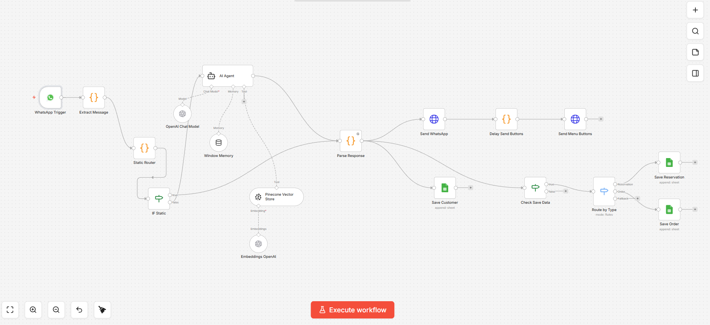
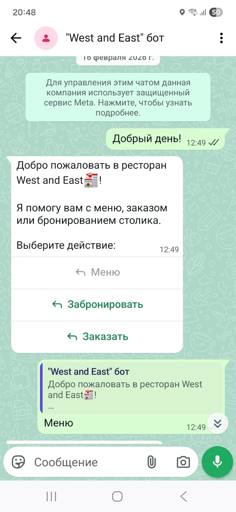
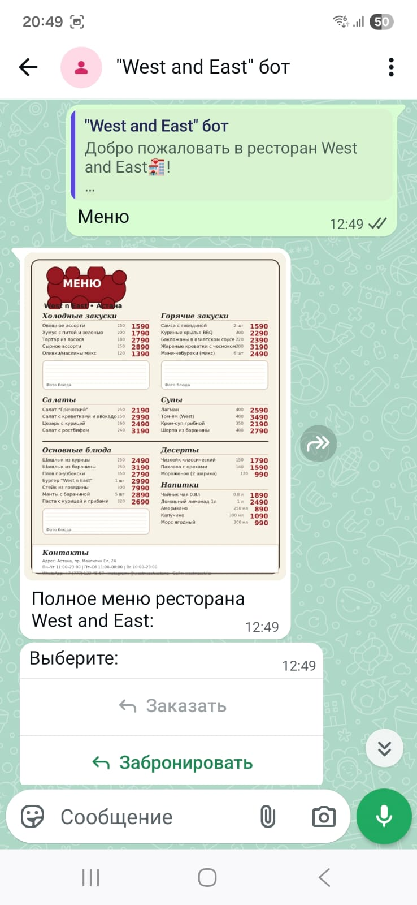
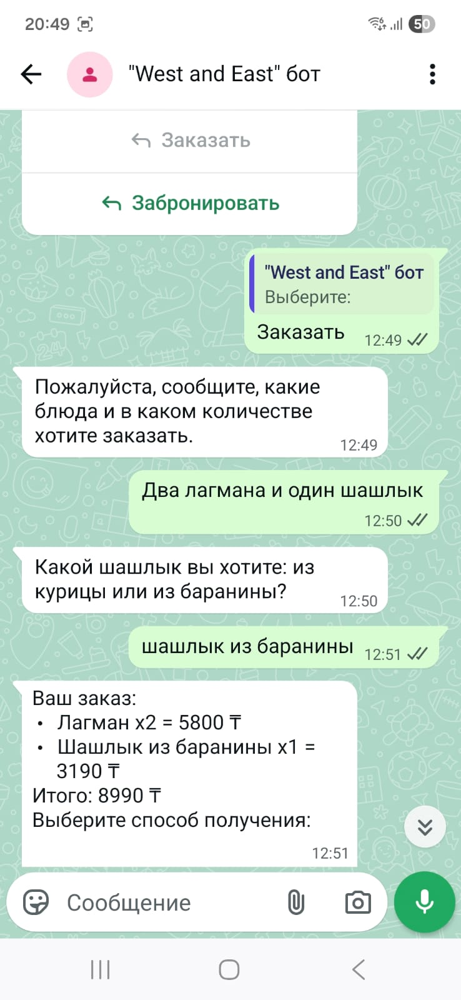

# 🍽️ Restaurant Bot (WhatsApp)

A WhatsApp bot for a restaurant with an AI agent built on [n8n](https://n8n.io). Handles food orders, table reservations, and menu questions — all in chat. All data is saved to Google Sheets automatically.

## Screenshots

### Workflow in n8n


### WhatsApp conversation




## Features

- **Smart menu Q&A** — AI agent searches a vector database (Pinecone) to answer questions about dishes, ingredients, and prices
- **In-chat ordering** — client places an order directly in WhatsApp, no website needed
- **Table reservations** — bot books a table and logs it to Google Sheets
- **Interactive menu buttons** — bot sends clickable menu sections for easy navigation
- **Static router** — instant replies to standard commands without calling the LLM
- **Customer logging** — every client's data is saved to a separate sheet

## Architecture

```
WhatsApp Trigger
    │
    ├─► Static Router ──► Static replies (menu, buttons)
    │
    └─► AI Agent (OpenAI)
            │   Knowledge base:
            │   └─ Pinecone — menu and restaurant info
            │
            └─► Route by Type:
                    ├─ Order       → Save Order (Google Sheets)
                    ├─ Reservation → Save Reservation (Google Sheets)
                    └─ Customer    → Save Customer (Google Sheets)
```

## Tech Stack

| Component | Technology |
|-----------|-----------|
| Automation | n8n |
| Messaging | WhatsApp Business API |
| AI model | OpenAI GPT |
| Vector database | Pinecone |
| Embeddings | OpenAI Embeddings |
| Data storage | Google Sheets |

## Setup

1. **Import the workflow** — upload `workflow.json` to your n8n instance
2. **Configure credentials:**
   - WhatsApp Business API (token and phone number)
   - OpenAI API key
   - Pinecone API key and index name
   - Google Sheets credentials
3. **Upload your knowledge base** to Pinecone — menu, dish descriptions, restaurant info
4. **Update spreadsheet IDs** in `Save Order`, `Save Reservation`, `Save Customer` nodes
5. **Activate** the workflow

## How It Works

1. Client sends a message to the restaurant's WhatsApp
2. Static Router checks — is it a standard command (e.g. "menu") or free text?
3. Standard commands → buttons or a fixed reply are sent immediately
4. Free text → AI agent understands the request via Pinecone and forms a response
5. If client places an order or reservation — data is saved to the corresponding Google Sheets

## Author

[Talgat Rashit](https://github.com/rasittalgat-alt)

---

# 🍽️ Ресторанный бот (WhatsApp)

WhatsApp-бот для ресторана с AI-агентом на базе [n8n](https://n8n.io). Принимает заказы, оформляет бронирование столиков, отвечает на вопросы по меню и сохраняет все данные в Google Sheets.

## Скриншоты

### Воркфлоу в n8n


### Диалог с ботом в WhatsApp


## Возможности

- **Умный ответ на вопросы** — AI-агент ищет информацию по векторной базе (Pinecone) и отвечает на вопросы о меню, составе блюд, ценах
- **Приём заказов** — клиент заказывает прямо в WhatsApp, данные сохраняются в таблицу
- **Бронирование столиков** — бот оформляет резервацию и записывает в Google Sheets
- **Интерактивные кнопки** — бот отправляет кнопки с разделами меню для удобной навигации
- **Статический роутер** — быстрые ответы на стандартные запросы без обращения к LLM
- **Сохранение клиентов** — данные каждого клиента логируются в отдельную таблицу

## Архитектура

```
WhatsApp Trigger
    │
    ├─► Static Router ──► Статические ответы (меню, кнопки)
    │
    └─► AI-агент (OpenAI)
            │   База знаний:
            │   └─ Pinecone — информация о меню и ресторане
            │
            └─► Route by Type:
                    ├─ Заказ      → Save Order (Google Sheets)
                    ├─ Резерв     → Save Reservation (Google Sheets)
                    └─ Клиент     → Save Customer (Google Sheets)
```

## Стек

| Компонент | Технология |
|-----------|-----------|
| Автоматизация | n8n |
| Мессенджер | WhatsApp Business API |
| AI-модель | OpenAI GPT |
| Векторная база | Pinecone |
| Эмбеддинги | OpenAI Embeddings |
| Хранение данных | Google Sheets |

## Установка и настройка

1. **Импортируй воркфлоу** — загрузи `workflow.json` в свой инстанс n8n
2. **Настрой учётные данные:**
   - WhatsApp Business API (токен и номер телефона)
   - OpenAI API-ключ
   - Pinecone API-ключ и индекс
   - Учётные данные Google Sheets
3. **Загрузи базу знаний** в Pinecone — меню, описания блюд, информация о ресторане
4. **Обнови ID таблиц** в узлах `Save Order`, `Save Reservation`, `Save Customer`
5. **Активируй** воркфлоу

## Как работает

1. Клиент пишет в WhatsApp ресторана
2. Static Router проверяет — это стандартная команда (например, «меню») или свободный текст
3. Стандартные команды → сразу отправляются кнопки или фиксированный ответ
4. Свободный текст → AI-агент понимает запрос через Pinecone и формирует ответ
5. Если клиент делает заказ или бронирование — данные сохраняются в соответствующие таблицы Google Sheets

## Автор

[Talgat Rashit](https://github.com/rasittalgat-alt)
